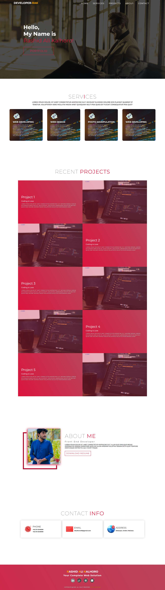

# :closed_book: Portfolio Website

### _portfolio website using js !!_

### Link :link: https://portfolio-developer-rak.netlify.app/

## Interface

## Run Locally

  - Run This command `https://github.com/developer-rak/rak-portfolio.git`
  - You are now in the dev environment and you can play around

## ⚙️ Tech Stack
  - HTML5
  - CSS
  - JavaScript
  - Netlify
